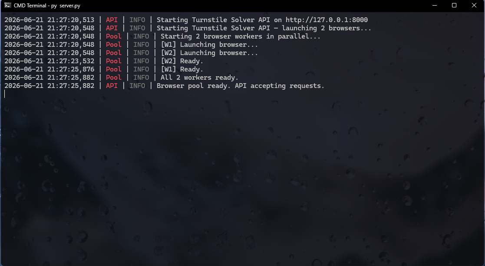

  

<h1 align="center">Turnstile Solver API</h1>

  <strong>Async Cloudflare Turnstile solver with a persistent browser pool</strong>
   
  Powered by <a href="https://github.com/daijro/camoufox">Camoufox</a> &amp; FastAPI

  <a href="#-features">Features</a> •
  <a href="setup.md">Setup Guide</a> •
  <a href="https://t.me/cfdevelopment">Telegram Support</a>

  
  
  

---

## 📸 Preview

  

---

## ✨ Features

* ⚡ **Asynchronous** – handles multiple solve requests concurrently without blocking.
* 🧩 **Persistent browser pool** – browsers stay alive between requests; no startup overhead.
* 🎯 **Queue‑based job processing** – tasks are distributed to available workers automatically.
* 🛡️ **Stealth** – uses Camoufox with safe Firefox prefs and WebRTC blocking.
* 📦 **Simple REST API** – submit jobs and poll for results with ease.
* ⚙️ **Configurable** – pool size, headless mode, timeouts, host/port via `config.json`.

---

## 🚀 Performance

| Metric | Value |
| :--- | :--- |
| Average solve time | 5 - 7 seconds (depends on challenge complexity) |
| Concurrent requests | Up to pool size (default: 3) |
| Token success rate | > 99% (with valid sitekey and URL) |

---

## 🤝 Integrations & Ecosystem

| Service | Role |
| :--- | :--- |
| **[Camoufox](https://github.com/daijro/camoufox)** | Stealth browser automation |
| **[FastAPI](https://fastapi.tiangolo.com/)** | High‑performance API framework |
| **[Uvicorn](https://www.uvicorn.org/)** | ASGI server |

---

## 👥 Contributors

* **`Zkamo`** — Developer

---

  ⚠️ <strong>Disclaimer:</strong> This project is intended for <strong>educational and legitimate automation</strong> purposes only. Respect the terms of service of the websites you interact with. Use at your own risk.

